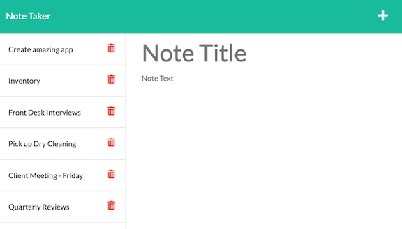

# Note-Saver

## Table of Contents
* [Description](#description)
* [Live Site](#live-site)
* [Installation](#installation)
* [Author](#author)
* [License](#license)

## Description
This application allows the user to create and save a note directly to the app. When the user first enters the page, they will click on the Get Started button to enter the notes page. They are then presented with a section to input the title of their note and any related content. The user must enter a title and input text into the body before they can save their note. Once text is written in the body of the note, a save icon will appear in the upper right hand corner of the page.
Additionally, the note will stay on the page even after a page refresh. If the user chooses, they can easily delete a note by clicking on the trash bin next to the note.
  

## Live Site
[Visit the Note Taker Application](https://obscure-waters-08324.herokuapp.com/)
 

 

## Installation
The following dependencies will be needed in order for this application to work:
* [Express.js](https://expressjs.com/)
* [Node.js](https://nodejs.org/en/)
* [Node module - FS(file system) ](https://nodejs.org/api/fs.html)
* [Short Unique ID](https://www.npmjs.com/package/short-unique-id)

## Author
Leslie Patino
* [Leslie's GitHub](https://github.com/lesliejpatino)
* [Leslie's LinkedIn](https://www.linkedin.com/in/lesliejpatino/)

## License

 
Copyright 2022 Leslie Patino 

Permission is hereby granted, free of charge, to any person obtaining a copy of this software and associated documentation files (the "Software"), to deal in the Software without restriction, including without limitation the rights to use, copy, modify, merge, publish, distribute, sublicense, and/or sell copies of the Software, and to permit persons to whom the Software is furnished to do so, subject to the following conditions: The above copyright notice and this permission notice shall be included in all copies or substantial portions of the Software.
    
THE SOFTWARE IS PROVIDED "AS IS", WITHOUT WARRANTY OF ANY KIND, EXPRESS OR IMPLIED, INCLUDING BUT NOT LIMITED TO THE WARRANTIES OF MERCHANTABILITY, FITNESS FOR A PARTICULAR PURPOSE AND NONINFRINGEMENT. IN NO EVENT SHALL THE AUTHORS OR COPYRIGHT HOLDERS BE LIABLE FOR ANY CLAIM, DAMAGES OR OTHER LIABILITY, WHETHER IN AN ACTION OF CONTRACT, TORT OR OTHERWISE, ARISING FROM, OUT OF OR IN CONNECTION WITH THE SOFTWARE OR THE USE OR OTHER DEALINGS IN THE SOFTWARE. 
